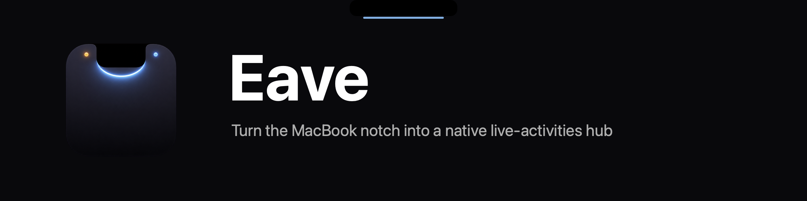
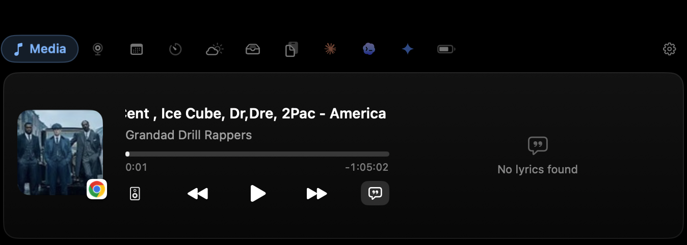
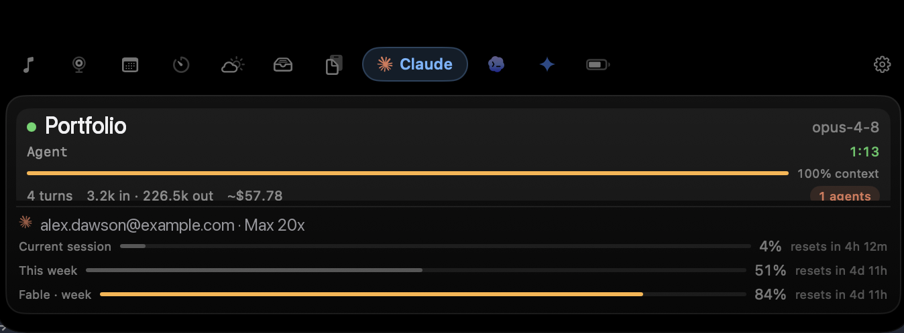
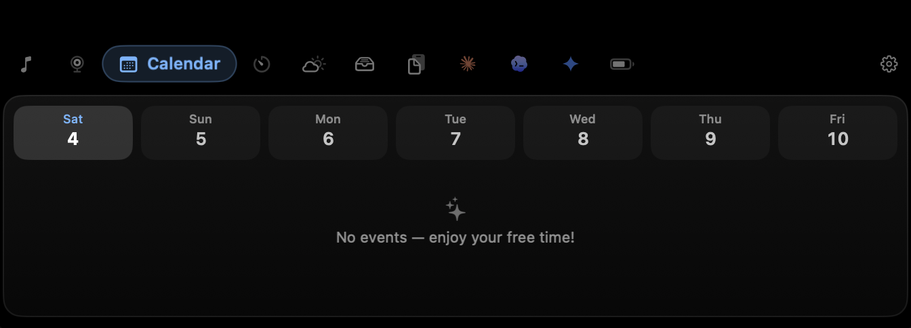
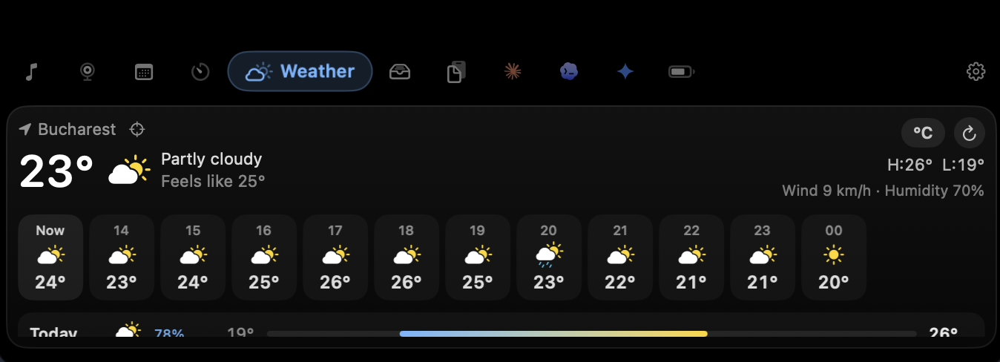
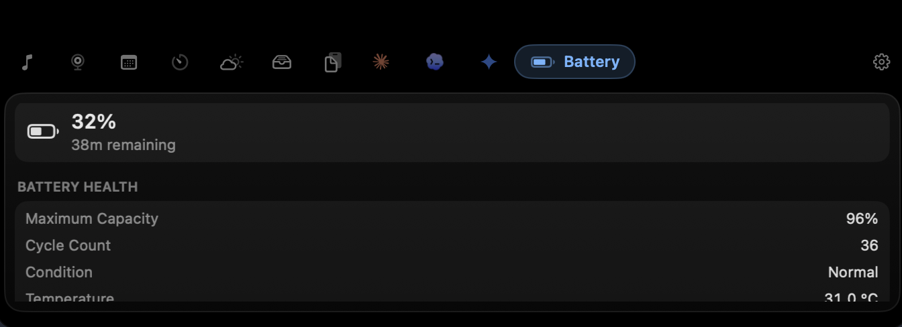
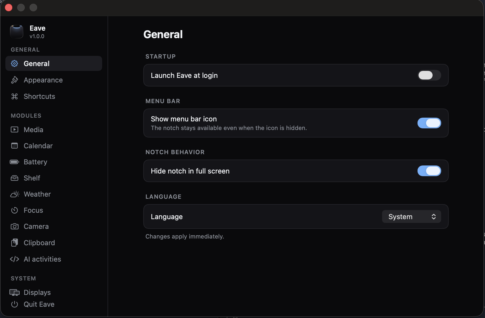

<p align="center">
  
</p>

# Eave

> [!NOTE]
> This is a **community hub**, not a source repository. It hosts Eave's
> signed release downloads, translations, and issue tracker. The app's source
> code is closed and is never published here.

**Turn the MacBook notch into a native live-activities hub.**

Eave lives in (and around) the notch. It shows what's playing, replaces the
system's clunky volume and brightness squares, keeps your next meeting one
glance away, holds files you're about to move, remembers your clipboard, runs
your focus sessions, and even watches your Claude Code sessions — all in a
panel that merges invisibly with the hardware cutout. 100% free.

<p align="center">
  <a href="https://github.com/beyondthecode-bc/Eave/releases/latest"></a>
  <a href="https://github.com/beyondthecode-bc/Eave/releases/latest"></a>
  <a href="https://github.com/beyondthecode-bc/Eave/stargazers"></a>
  
</p>

<p align="center">
  
  
  
  
  
</p>

<p align="center">
  <a href="https://github.com/sponsors/beyondthecode-bc"></a>
  <a href="https://www.buymeacoffee.com/BEYONDTHECODE"></a>
</p>

<p align="center">
  Built with Swift and SwiftUI. No Electron, no web views, no bloat.
</p>

---


<!-- os27-compatibility:start -->
## OS 27 compatibility

Updated 2026-09-16.

- **GitHub — Version 1.1.2:** OS 27 compatibility checked with Xcode 27 builds and automated regression tests. The universal download restores the bundled media framework’s macOS 14 minimum requirement.

Checks use Xcode 27 builds and automated tests where available. Full testing on physical devices has not been completed. Minimum OS requirements are unchanged.
<!-- os27-compatibility:end -->

## Why Eave

### Reliable

- **Developer-ID signed + notarized by Apple** — no Gatekeeper "unidentified
  developer" wall, ever.
- **Survives sleep/wake and display changes** — the notch panel re-attaches
  cleanly when you close the lid, dock, or unplug a monitor.
- **Built-in updater** — Settings → About → Check for Updates → Install Now.
  Checks GitHub Releases directly.

### Light

Zero dependencies, no web views, and an event-driven engine that sleeps when
nothing is happening. Measured on an M4 Pro MacBook Pro:

| Metric | Measured |
|---|---|
| CPU (idle, panel closed) | < 1% (~0%) |
| Memory | ~80 MB |
| Frameworks bundled | 1 (vendored now-playing adapter) |

### Every screen

- **Island mode on external displays** — Eave doesn't draw a fake notch on
  monitors that don't have one. External displays get a floating island that
  looks like it belongs there.
- **DDC brightness** — control external-monitor brightness from Eave's HUD,
  straight over the display cable (experimental).

## Features

- **Now Playing** — album art, title, and transport controls (play/pause,
  next/previous, seek) for whatever macOS is playing: Music, Spotify,
  browsers, podcast apps.
- **Replacement HUDs** — volume, display brightness, and keyboard backlight
  as sleek notch-anchored HUDs instead of the system's center-screen squares.
- **Calendar & Reminders** — your next events and due reminders, one hover
  away.
- **File shelf** — drag files onto the notch to stage them, drag them out
  later, or **AirDrop straight from the shelf**.
- **Clipboard history** — searchable history with a privacy filter that
  skips password managers and other sensitive content.
- **Focus** — a Pomodoro timer that can keep your Mac awake for the length
  of a session.
- **Claude Code monitor** — live status of your running Claude Code sessions
  (working / waiting for you / done) right in the notch.
- **Battery live activity** — charge and low-battery states at a glance.
- **External display support** — island mode plus DDC brightness control.
- **8 languages** — switch at runtime in Settings, no relaunch needed.
- **Free** — all of it. No Pro tier, no accounts, no telemetry.

## Screenshots

|  |  |
|---|---|
|  |  |
| **Now Playing** — album art and transport controls, right in the notch. | **AI activities** — live status of your Claude Code sessions. |
|  |  |
| **Calendar** — your week and next events, one glance away. | **Weather** — current conditions and an hourly forecast. |
|  |  |
| **Battery** — charge, health, and cycle count at a glance. | **Settings** — grouped, per-module toggles for everything. |

## Update or install

1. **Existing users — update in app:** Open **Settings > About > Check for Updates > Install Now**. The installer verifies the downloaded ZIP against its published checksum.
2. **New installation:** download [**`Eave-1.1.2.zip`**](https://github.com/beyondthecode-bc/Eave/releases/download/v1.1.2/Eave-1.1.2.zip), extract it, and move **`Eave.app`** to **Applications**.
3. **Manual fallback:** if the in-app updater is unavailable or fails, quit the app, extract the same ZIP, and replace the existing app in Applications.

## Verify the download

- Signed with Developer ID, hardened runtime and a secure timestamp. Apple notarization accepted; ticket stapled; Gatekeeper verification passed.
- VirusTotal: **0 malicious, 0 suspicious**; 64 undetected, 3 timeout, 7 type-unsupported. [View the exact-file report](https://www.virustotal.com/gui/file/3150a5793df9651f00a2dffa2cb076563b4d67896751a1972456081719feec94).
- Asset: **`Eave-1.1.2.zip`** (version **1.1.2**, build **5**). The sibling **`Eave-1.1.2.zip.sha256`** contains the same checksum.

**SHA-256**

```text
3150a5793df9651f00a2dffa2cb076563b4d67896751a1972456081719feec94
```

## Requirements

| | Requirement |
|---|---|
| **OS** | macOS 14.0 (Sonoma) or later |
| **Chip** | Any Mac (Apple Silicon or Intel) |
| **Notch** | Not required — Macs without one get the floating island |

## Getting Started

### 1. Install and launch

Download from [Releases](https://github.com/beyondthecode-bc/Eave/releases/latest),
unzip, move `Eave.app` to Applications, and open it. The notch comes alive
immediately — no setup wizard, no account.

### 2. What works with zero permissions

Out of the box, without granting anything: **Now Playing** and media
controls, the **file shelf** (including AirDrop), **clipboard history**, the
**Focus timer**, **battery** activity, and **external-display island mode**.

### 3. Optional grants (only if you want the module)

| Permission | Unlocks | Where |
|---|---|---|
| Accessibility | Replacement HUDs (intercepts the volume/brightness keys) | System Settings → Privacy & Security → Accessibility |
| Calendars & Reminders | The Calendar module | Prompted when you enable it |

Eave asks only when you switch a module on, and everything else keeps working
if you decline.

## Translations

Eave is localized via XML files in [`languages/`](languages/). To contribute
a translation, copy `English.xml`, translate the values (keep the `key`
attributes unchanged, and keep `%1`, `%@`, `%d` placeholders in place), and
open a pull request or a
[Translation issue](https://github.com/beyondthecode-bc/Eave/issues/new?template=translation.md).

| Language | File |
|---|---|
| English | [`English.xml`](languages/English.xml) |
| French | [`French.xml`](languages/French.xml) |
| German | [`German.xml`](languages/German.xml) |
| Spanish | [`Spanish.xml`](languages/Spanish.xml) |
| Japanese | [`Japanese.xml`](languages/Japanese.xml) |
| Korean | [`Korean.xml`](languages/Korean.xml) |
| Portuguese (BR) | [`Portuguese.xml`](languages/Portuguese.xml) |
| Chinese (Simplified) | [`Chinese.xml`](languages/Chinese.xml) |

## Troubleshooting

### Gatekeeper warning on first launch?

You shouldn't see one — Eave is Developer-ID signed and **notarized by
Apple**. If macOS warns you about the app anyway, you are not running an
official build; delete it and download only from
[Releases](https://github.com/beyondthecode-bc/Eave/releases/latest).

### Media isn't detected

Eave shows whatever macOS's Now Playing system knows about. If nothing
appears, check that the source app is actually playing and shows up in
Control Center's media widget — some apps (and some browser tabs) only
publish once playback starts. Restarting the source app usually fixes it.

### Replacement HUDs aren't appearing

The HUD module needs the **Accessibility** permission to intercept the
volume/brightness keys. Grant it in System Settings → Privacy & Security →
Accessibility, then toggle the module off and on.

### External-monitor brightness doesn't change

DDC brightness is **experimental**. It depends on your monitor and
connection: some displays ignore DDC commands, and many USB hubs, KVMs, and
DisplayLink adapters don't pass DDC through. Connect the display directly if
you can.

### Administrator password when installing an update

When you click **Install Now** in About, macOS asks for your password before
replacing the app in `/Applications`. This is expected — the app needs
elevated permissions to overwrite itself.

## Support

- [Report a bug](https://github.com/beyondthecode-bc/Eave/issues/new?template=bug_report.md)
- [Request a feature](https://github.com/beyondthecode-bc/Eave/issues/new?template=feature_request.md)
- Homepage: https://beyondthecode.app

If Eave is useful to you, consider supporting development:

<p align="center">
  <a href="https://github.com/sponsors/beyondthecode-bc">
    
  </a>
  &nbsp;&nbsp;&nbsp;
  <a href="https://www.buymeacoffee.com/BEYONDTHECODE">
    
  </a>
</p>

## Acknowledgements

- [mediaremote-adapter](https://github.com/ungive/mediaremote-adapter) —
  © ungive, BSD-3-Clause. Powers Now Playing detection and media commands on
  modern macOS.

---

Made by [Beyond the Code](https://beyondthecode.app).
